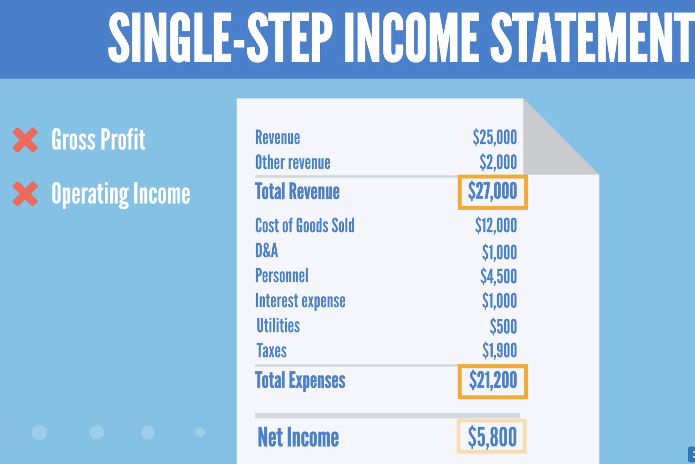
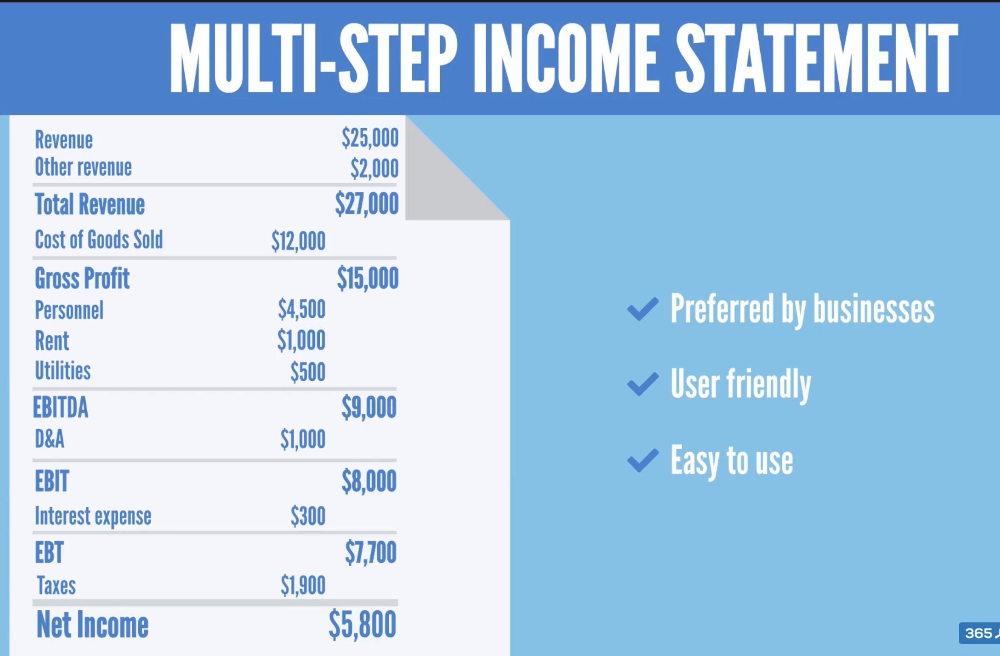

# Accounting and Financial Statement Analysis

## Section 1: Introduction to Accounting
__What is Accounting and Why Do We Need It?__   
Accounting is an information science that is used to collect and organize financial information for organization and individuals.   

__Why do we need it?__   
Accounting helps to organize and represents financial information for organizations and individuals to
* Understand their finances
* Make decisions about the future

It helps us to use the past to take action in the present to change the future.

__What types of accounting are there?__   
1. __Book Keeping__  
Responsible for collection of financial information. It ensures that financial information has been collected systematically.
2. __Financial Accounting__  
Focuses on financial statement such as
* Income Statement
* Balance Sheet
* Cash Flow Statement  
Along with _Explanatory notes_  and _Management discussions & analysis (MD&A)_ to prepare the annual report for a company.    
Financial statements are prepared according to specific set of rules called _Accounting Principles_.    
Financial statement are publicly accessible outside of the company to Banks and Investors and Stake Holders.
3. __Managerial Accounting__   
It is available only for insiders and not defined by _Accounting Principles_, and more details than financial accounting.    
It includes things like
* Pricing
* Marginality
* Competition
* Budgeting
4. __Tax Accounting__  
It determines the amount of taxes that a company has to pay.  
It varies for different legislations around the world and is not covered in this course.  

This course covers only _BookKeeping_ and _Financial Accounting_.  

### BookKeeping
__The importance of Bookkeping__  
BookKeeping is the collection and proper categorization of financial information, which illustrates the impact of business activities.  
Book keeping is fundamental for corporations, banks, investment funds and individuals.  
Recording every transaction that take place in a company is paramount.   
Booking keeping is the corner stone around which all accounting in constructing.   

__Who Needs Financial Reports?__  
The main output of financial accounting is a set of reports (financial statements) provided to people outside of an organization.  
The financial statements of a company helps external stakeholders to gain understanding of the company's business and gain insight into it's performance year over year.  
It provides informations such as
* Profitability
* Revenue and costs
* What the firm owns and owes
* Available cash balance

## Section 2: The Three Main Statements in Financial Accounting
Financial Accounting revolve around 3 main statements
1. Income statement: (aka Profile and Loss (P&L))
2. Balance Sheet
3. Cash Flow Statement

__Income Statement__    
It tells us how the company perform throughout the period under consideration. Did it product a profit or a loss?  
Typically an income statement is prepared for a 1-year period, but some large companies me prepare a quarterly income statement.  
It helps us determine wether the operations of the firm created economic value.   
It also enables us to find importance trends such as
* Revenue Growth
* Incidence of gross profit on revenue

__Balance Sheet__  
It tells us what the company owe and what it owns on a certain date.  
It tells us the company's financial position.  
It shows use
* Assets controlled by the company
* Liabilities owed by the company (Debt)
* Equity amount that belongs to equity holders.

It is called a balance sheet because it must be that
```
Total Assets = Total Liability + Shareholder Equity
```

On a balance sheet, the assets must be on the left hand side and the liabilities and share holder equity must be on the right.  

__Cash Flow Statement__  
It tells us how much cash the company made during the period under consideration and where it came from.  
Income is not equal to cash, so the cash flow statement shows
* Cash movement
* the liquidity that is generated by the firm's operation

##### Annual Reports
The three financial statement (Income Statement, Balance Sheet and Cash Flow Statement) are found in a company's annual report.  

#### Income Statement Items
Here are the main income statement items that a firm will register throughout it's business cycle.
1. Revenue
2. Expenses
3. Net Income

__Revenue__  
This represents an inflow of economic resource. For example, the revenue derived from selling the company's core product. It is also known as _Net Sales_.  

Sometimes company may make money from selling product that is not their core business activity e.g renting it's real estate. This is classified under a different account named _Other Revenue_.   
```
Net Sales + Other Revenue = Total Revenue
```

__Expenses__  
These represents the outflow of economic resources. This is needed to product the goods and fuel the sales the the company delivers to it's clients.  
The different types of expenses are
1. __Cost of goods sold (COGS)__: Expenses necessary to product the goods sold. The includes the cost of the materials used to create the goods and the amount paid to personnels directly involved with the production of the good.  
```
Total Revenue - COGS = Gross Profit
```
Gross Profit is an important financial indicator for a business.  
Total Revenue - COGS = EBITDA _Earnings before Interest, Tax, Depreciation and Amortization_   
EBITDA is one of the most popular measures of operating income. It shows us how much we've made once we've considered both direct and indirect expenses.   

2. __Selling, general and administrative expenses (SG&A)__: This is also know as _Operating Expenses_. The operating expenses covers:
  - Advertising and promotions
  - Salaries of personnels not directly involved in the production process
  - Office Rent
  - Utility Bills
  - Nearly everything that is not related to COGS, D&A or Interest expenses
3. __Depreciation and amortization (D&A)__: Represents the "using up" of tangible and intangible assets.  
  - Depreciation - Referring to assets of a physical nature and covers tangible assets such as Property, Equipment, Plant, Vehicle etc.   
  - Amortization - for intangible assets, referrers to things like, GoodWill, Licenses, Copyright, Others.
The account for the reduction in value of it tangible assets, the company registers a depreciation expense.  
```
EBITDA - D&A = EBIT
````
_EBIT_ - Earning Before Interest & Taxes
The _EBIT_ is another measure of operating profitability and it is different from EBITDA because it considers D&A.  
Some companies does not have much of a D&A and thus prefers _EBITDA_ as their choose of measure of profitability. Other companies spent a constant amount on _D&A_ every year and they prefer _EBIT_ as their measure of operating profitability.  
4. __Interest expenses__: Represents the costs the company bears for receiving financing.  

5. __Taxes__  
Every company pays cooperate taxes that is proportional to the amount of pre-tax profit generated.  The amount paid on taxes varies depending on the jurisdiction where the company operates.  

__Net Income__    
Once all expenses are considered, we arrive at the the bottom line or net income.  
The is the excess of revenue over expenses. It is the profitability of a business after accounting for all cost.  

```
Revenue - COGS = Gross Profile
Gross Profit - SG&A  = Operating Profit  
Operating Profile - Interest Expense - Tax Expense = Net Income
```

EBT - Earning Before Taxes
```
EBT - Taxes - Net Income
```

#### Revenue Recognition Principle    
Financial authorities must ensure that all companies report their revenue in a consistent and unbiased manner.   
They have to be certain that the firm follows a certain set of rules that impedes them from recognizing revenue in the wrong accounting period. Otherwise companies may take advantage of reporting revenue in a wrong period to improve their top line and boost their profitability.   
Bodies the the _Financial Accounting Standard Board (FASB)_ or the _International Accounting Standard Board (IASB)_  have created a rigid set of rules for proper revenue recognition.  
According to the _FASB_, revenue is recognized in the Income Statement when it is realized or realizable and earned not matter when the cash is received.   
The _US Security and Exchange Commission give the following guidelines: Revenue should be recognized when:
  - There is evidence of an arrangement between the buyer and the seller
  - The product has been delivered or the service has been rendered
  - The price is determined or is determinable
  - The seller is reasonably sure of collecting the cash
These are the criteria that need to be satisfied in other to book revenue in a given period.    

#### Expense Recognition Principle  
There is a set of rules that regulates the correct period in which expenses should be recorded.  
Financial authorities cannot allow companies to manage this process on their own without supervision.  
Authorities use the _matching principles_ which sates that: revenue and relates costs are recognized in the same accounting period. The matching principle applies to all the cost involved in the production process.   
Not all cost are directly linked to the production process, for example _period costs_ which includes administrative and utility expenses.  
Period costs should be recorded in the period they are incurred regardless of the time the revenue is earned.  

#### Income Tax
SomeTimes
```
Accounting Profit != Tax Profit
```  
__Accounting Profit__: Accounting entries respect accounting standards.   
__Tax Profit__:  Tax calculations are performed based on Federal Tax and State Tax laws.  
For example some cost can be registered as expenses in P&L statement but will be registered as deductible from the perspective of a tax calculation.  
Tax calculation is a topic of it's own and is an activity performed by tax professionals.  
Financial analysts and Financial managers are rarely involved in tax discussions.  
When financial analyst are working on cash flow analysis or financial models they apply an _average tax rate_ the company has paid.
```
Average tax rate = Income Taxes / Earning Before Taxes (EBT)  
```

### Main P&L Formats
1. __Single Step__: In this format, there are no intermediary results such as Gross Profit or Operating Income. It simple subtracts Total Cost from Total Revenue to get the Net Income.  

2. __Multi Step__:  This format shows us the difference in Revenue and COGS which is Gross Profit and also Operating Income.  Most company prefers the Multi Step format.   


### Balance Sheet  
